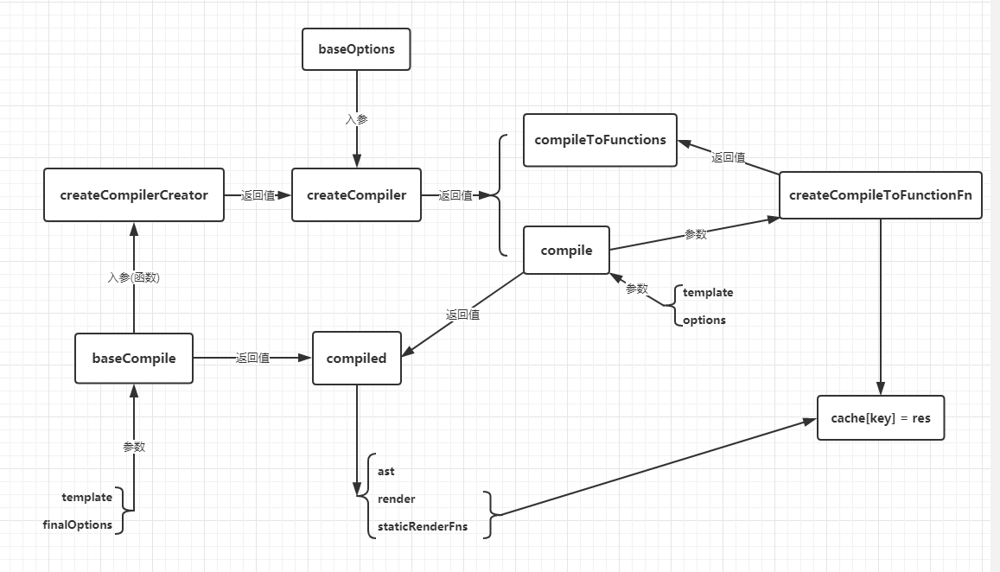
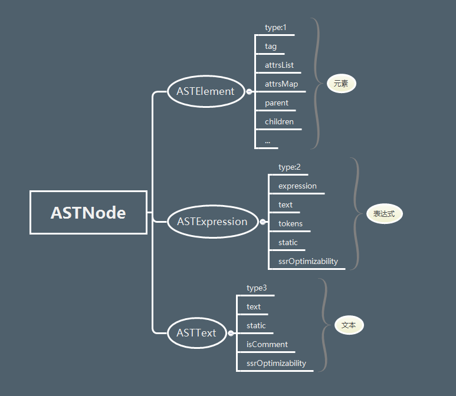
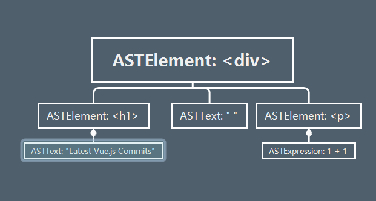

# 咱来聊聊 Vue — 编译原理

> 在 Vue 里，模板编译也是非常重要的一部分，里面也非常复杂，这次探究不会深入探究每一个细节，而是走一个全景概要，来吧，大家和我一起去一探究竟。

## 初体验

我们看了 Vue 的初始化函数就会知道，在最后一步，它进行了 __vm.$mount(el)__ 的操作，而这个 $mount 在两个地方定义过，分别是在 __entry-runtime-with-compiler.js(简称：eMount)__ 和 __runtime/index.js(简称：rMount)__ 这两个文件里，那么这两个有什么区别呢？

```js
// entry-runtime-with-compiler.js
const mount = Vue.prototype.$mount // 这个 $mount 其实就是 rMount
Vue.prototype.$mount = function (
  el?: string | Element,
  hydrating?: boolean
): Component {
  const options = this.$options
  if (!options.render) {
    ...
    if(template) {
      const { render, staticRenderFns } = compileToFunctions(template, {
        shouldDecodeNewlines,
        shouldDecodeNewlinesForHref,
        delimiters: options.delimiters,
        comments: options.comments
      }, this)
      options.render = render
      options.staticRenderFns = staticRenderFns
    }
    ...
  }
  return mount.call(this, el, hydrating)
}
```

其实 eMount 最后还是去调用的 rMount，只不过在 eMount 做了一定的操作，如果你提供了 render 函数，那么它会直接去调用 rMount，如果没有，它就会去找你有没有提供 template，如果你没有提供 template，它就会用 el 去查询 dom 生成 template，最后通过编译返回了一个 render 函数，再去调用 eMount。

那么编译最重要的部分就是 compileToFunctions 这个函数，他最后返回了 render 函数，关于这个函数，它有点复杂，我画了一张图来看一看它的关系，可能会有误差，希望大侠们可以指出。



## 编译三步走

看一下这个编译的整体过程，我们其实可以发现，最核心的部分就是在这里传进去的 baseCompile 做的工作：

- parse: 第一步，我们需要将 template 转换成抽象语法树(AST)。
- optimizer: 第二步，我们对这个抽象语法树进行静态节点的标记，这样就可以优化渲染过程。
- generateCode: 第三步，根据 AST 生成一个 render 函数。

好了，我们接下来就一个一个慢慢看。

### 解析器

在解析器中有一个非常重要的概念 AST，大家可以去自行了解一下。

在 Vue 中，ASTNode 分几种不同类型，关于 ASTNode 的定义在 __flow/compile.js__ 里面，请看下图：



我们用一个简单的例子来说明一下：

```html
<div id="demo">
  <h1>Latest Vue.js Commits</h1>
  <p>{{1 + 1}}</p>
</div>
```

那么我们想一想这段代码会生成什么样的 AST 呢？



我们这个例子最后生成的大概就是这么一棵树，那么 Vue 是如何去做这样一些解析的呢？我们继续看。

在 parse 函数中，我们首先是定义了非常多的全局属性以及函数，然后调用了 parseHTML 这么一个函数，也是 parse 最核心的函数，这个函数会不断的解析模板，填充 root，最后把 root(AST) 返回回去。

#### parseHTML

在这个函数中，最重要的是 while 循环中的代码，而在解析过程中发挥重要作用的有这么几个正则表达式。

```js
const attribute = /^\s*([^\s"'<>\/=]+)(?:\s*(=)\s*(?:"([^"]*)"+|'([^']*)'+|([^\s"'=<>`]+)))?/
const ncname = '[a-zA-Z_][\\w\\-\\.]*'
const qnameCapture = `((?:${ncname}\\:)?${ncname})`
const startTagOpen = new RegExp(`^<${qnameCapture}`)
const startTagClose = /^\s*(\/?)>/
const endTag = new RegExp(`^<\\/${qnameCapture}[^>]*>`)
const doctype = /^<!DOCTYPE [^>]+>/i
const comment = /^<!\--/
const conditionalComment = /^<!\[/
```

Vue 使用正则表达式去匹配开始结束标签、标签名、属性等等。

关于 while 的详细注解我放在我仓库里了，有兴趣的可以去看看。

在 while 里，其实就是不断的去用 `html.indexOf('<')` 去匹配，然后根据返回的索引的不同去做不同的解析处理：

- 等于 0：这就代表这是注释、条件注释、doctype、开始标签、结束标签中的某一种
- 大于等于 0：这就说明是文本、表达式
- 小于 0：表示 html 标签解析完了，可能会剩下一些文本、表达式

parse 函数就是不断的重复这个工作，然后将 template 转换成 AST，在解析过程中，其实对于标签与标签之间的空格，Vue 也做了优化处理，有些元素之间的空格是没用的。

compile 其实要说要说非常多的篇幅，但是这里只能简单的理一下思路，具体代码还需要各位下去深扣。

### 优化器

>  从代码中的注释我们可以看出，优化器的目的就是去找出 AST 中纯静态的子树：
>
> 1. 把纯静态子树提升为常量，每次重新渲染的时候就不需要创建新的节点了
> 2. 在 patch 的时候就可以跳过它们

optimize 的代码量没有 parse 那么多，我们来看看：

```js
export function optimize (root: ?ASTElement, options: CompilerOptions) {
  // 判断 root 是否存在
  if (!root) return
  // 判断是否是静态的 attr 属性
  // 'type,tag,attrsList,attrsMap,plain,parent,children,attrs'
  isStaticKey = genStaticKeysCached(options.staticKeys || '')
  // 判断是否是平台保留的标签，html 或者 svg 的
  isPlatformReservedTag = options.isReservedTag || no
  // 第一遍遍历: 给所有静态节点打上是否是静态节点的标记
  markStatic(root)
  // 第二遍遍历:标记所有静态根节点
  markStaticRoots(root, false)
}
```

下面两段代码我都剪切了一部分，因为有点多，这里就不贴太多代码了，详情请参考[我的仓库](./optimize.md)。

#### 第一遍遍历

```js
function markStatic (node: ASTNode) {
  node.static = isStatic(node)
  if (node.type === 1) {
    ...
  }
}
```

其实 markStatic 就是一个递归的过程，不断地去检查 AST 上的节点，然后打上标记。

刚刚我们说过，AST 节点分三种，在 isStatic 这个函数中我们对不同类型的节点做了判断：

```js
function isStatic (node: ASTNode): boolean {
  if (node.type === 2) { // expression
    return false
  }
  if (node.type === 3) { // text
    return true
  }
  return !!(node.pre || (
    !node.hasBindings && // no dynamic bindings
    !node.if && !node.for && // not v-if or v-for or v-else
    !isBuiltInTag(node.tag) && // not a built-in
    isPlatformReservedTag(node.tag) && // not a component
    !isDirectChildOfTemplateFor(node) &&
    Object.keys(node).every(isStaticKey)
  ))
}
```

可以看到 Vue 对下面几种情况做了处理：

1. 当这个节点的 type 为 2，也就是表达式节点的时候，很明显它不是一个静态节点，所以返回 false
2. 当 type 为 3 的时候，也就是文本节点，那它就是一个静态节点，返回 true
3. 如果你在元素节点中使用了 v-per 或者使用了 `<pre>` 标签，那么就会在这个 node 上加上 pre 为 true，那么这就是个静态节点
4. 如果它需要时静态节点，那么需要它不能有动态的绑定、不能有 v-if、v-for、v-else 这些指令，不能是 slot 或者 component 标签、不是我们自定义的标签、没有父节点或者元素的父节点不能是带 v-for 的 template、 这个节点的属性都在 __type,tag,attrsList,attrsMap,plain,parent,children,attrs__ 里面，满足这些条件，就认为它是静态的节点。

### 代码生成器
